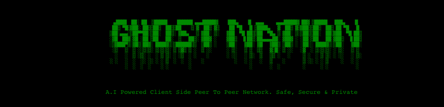

# Features

- [x] Video Chat
- [x] Audio Chat
- [x] Text Messages
- [x] Unlimited size file Transfer (In 16kb chunks)
- [x] Person Detection
- [ ] Text Toxicity Detection
- [ ] Text Auto Completion
- [ ] Screen Cast
- [ ] Multiple Peers (Not full-mesh)

# How To Use

Open the project [[link](https://rakesh4real.github.io/P2P-V2/)]  in two different devices - **DEV1**(Initioates connection) & **DEV2** (Joins connection)

- Give access to webcam in both devices on promt (Required and NOT optional)
- **[DEV1]** Initate connection by clicking on `INITATE CONNECTION`. Your ID/Payload will appear in field below in 5 secs (if it doesn't refresh the page. It should appear in 5 secs then)
- **[DEV1]** Copy your ID/Payload and transfer it to DEV2. Use secure medium
- **[DEV2]** Paste the recieved ID/Payload in `Join Connection` field. Click on `CONNECT`. (It will turn into `CONNECTED FROM YOUR SIDE!`)
- **[Dev2]** In 5 secs, Your ID/Payload will appear in `Start Connection` block's field. Transfer it to DEV1
- **[Dev1]** Paste the recieved ID/Payload in `Join Connection` field. Click on `CONNECT` (It will turn into `CONNECTED FROM YOUR SIDE!`)
- All set! Now you can see your peer's and your webcam. Whatever text message you send/receive will be logged at end of screen.

# Licence

**Ghost Nation** is distributed under the [Academic Public License](LICENSE.txt).
